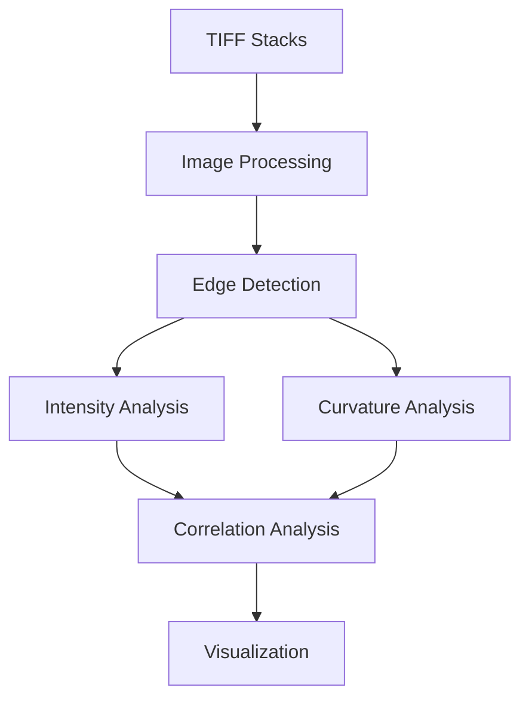

# PIEZO1 Analysis Pipeline Architecture

## Analytical Framework Overview

The PIEZO1 analysis pipeline is designed to quantitatively assess the relationship between membrane curvature and PIEZO1 protein distribution. The system integrates image processing, geometric analysis, and statistical correlation through a modular architecture.

## Data Flow and Module Interaction



### 1. Image Processing Module (`image_processing/`)
**Primary Functions:**
- TIFF stack management and synchronization
- Channel overlay generation
- Image normalization and enhancement

**Key Components:**
```python
TiffHandler:
    - Stack loading and frame management
    - Dimensional validation
    - Frame synchronization

ImageOverlay:
    - Channel mixing and visualization
    - Opacity control
    - Real-time overlay updates
```

### 2. Analysis Module (`analysis/`)
**Core Analytical Pipeline:**

#### a. Edge Detection
```python
Input: Binary segmented image
Process: 
    1. Contour detection
    2. Edge smoothing (adjustable window)
    3. Boundary validation
Output: Cell edge coordinates and smoothed contour
```

#### b. Intensity Analysis
```python
Input: 
    - PIEZO1 fluorescence image
    - Cell edge coordinates
Process:
    1. Normal vector calculation
    2. Interior direction validation
    3. Rectangular sampling region definition
    4. Intensity measurement
Output: Position-indexed intensity measurements
```

#### c. Curvature Analysis
```python
Input: Smoothed cell edge coordinates
Process:
    1. Spline parameterization
    2. Local curvature calculation
    3. Scale-space analysis
Output: Position-indexed curvature measurements
```

### 3. GUI Module (`gui/`)
**Interface Components:**
- Main application window (`main_window.py`)
- Image viewer (`image_view.py`)
- Analysis controls (`toolbar.py`)
- Results visualization (`results_window.py`)

## Data Structure and Flow

### 1. Input Data
```python
class ImageStack:
    dimensions: (frames, height, width)
    dtype: uint8/uint16
    metadata: dict
```

### 2. Analysis Results
```python
class AnalysisResults:
    edge_coordinates: np.ndarray  # (n_points, 2)
    intensities: np.ndarray      # (n_points,)
    curvatures: np.ndarray      # (n_points,)
    correlation: float          # Pearson's r
```

### 3. Module Communication
```python
# Example interaction flow
class AnalysisPipeline:
    def process_frame(self, frame_index):
        # 1. Get current frames
        cell_frame = self.tiff_handler.get_cell_frame(frame_index)
        piezo_frame = self.tiff_handler.get_piezo_frame(frame_index)
        
        # 2. Detect and analyze edge
        edge = self.edge_detector.detect(cell_frame)
        smoothed_edge = self.edge_detector.smooth(edge)
        
        # 3. Calculate measurements
        intensities = self.intensity_analyzer.measure(
            piezo_frame, smoothed_edge)
        curvatures = self.curvature_analyzer.calculate(
            smoothed_edge)
            
        # 4. Update visualization
        self.results_window.update(
            intensities, curvatures, smoothed_edge)
```

## Key Algorithms and Methods

### 1. Edge Processing
- Contour detection using border following
- Gaussian smoothing with adjustable window
- Spline-based contour parameterization

### 2. Intensity Sampling
- Normal vector computation
- Interior point validation
- Rectangle-based sampling regions

### 3. Curvature Analysis
- Local geometric curvature calculation
- Multi-scale analysis capabilities
- Correlation with intensity measurements

## Quality Control and Validation

### 1. Input Validation
- Image stack dimensional checks
- Data type verification
- Frame synchronization validation

### 2. Analysis Validation
- Edge detection quality metrics
- Sampling region verification
- Curvature calculation stability checks

### 3. Output Validation
- Statistical significance testing
- Correlation analysis robustness
- Visual result verification

## Performance Considerations

### 1. Computation Optimization
- Vectorized operations for bulk processing
- Efficient memory management
- Parallel processing capabilities

### 2. Real-time Updates
- Progressive computation
- Asynchronous display updates
- Memory-efficient data structures

### 3. Error Handling
- Robust exception management
- Graceful failure recovery
- Comprehensive error reporting

## Future Extensions

The modular architecture supports easy integration of:
1. Additional analysis methods
2. New visualization techniques
3. Enhanced statistical analysis
4. Batch processing capabilities
5. Extended data export options

## Technical Dependencies

- **Core Processing:** NumPy, SciPy
- **Image Analysis:** OpenCV, scikit-image
- **Visualization:** PyQt6, Matplotlib
- **Data Management:** tifffile

## Version Control and Documentation

All modules are documented using Python docstrings and include:
- Function specifications
- Parameter descriptions
- Return value definitions
- Usage examples
- Algorithm references